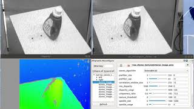
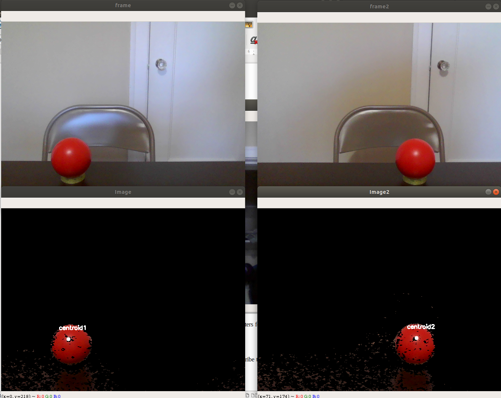
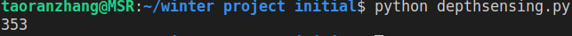

# Depth from Stereo!
## Taoran Zhang
****
## Project Overview
This ROS Melodic package realizes generating disparity map from the data obtained on the internet, and then uses the same idea to get the distance from the cameras to a red ball.

****
## Project Structure and difficulties/restrictions
This project can be devided into two parts. One is disparity generating using rosbag from the internet, which gives the feel of how stereo vision works. The other is to implement the same idea to find the depth from the cameras to a red ball.

The main difficulty is that here I tried to use one camera to get the depth value. Therefore 2 images from 2 different perspectives from the same camera are needed to generate disparity so that depth can be calculated. The biggest restriction for my project is that the 2 camera positions must be aligned in the same plane. Also they shouldn't be too far apart since both of them should have the object(red ball) in the field of view.

## Methodology
The idea behind this multiview methodology is pretty simple, which can be better illustrated by the graph below:

Image source: OpenCV, 

Then the depth can be calculated from the formula:

Where disparity is the distance between points in image plane corresponding to the scene point 3D and their camera center. B is the distance between two cameras(which can be obtained by the movement of the Sawyer) and f is the focal length of camera(obtained by calibration). In short, above equation says that the depth of a point in a scene is inversely proportional to the difference in distance of corresponding image points and their camera centers. With this information, we can derive the depth of all pixels in an image.

## Launchfile

### disparity.launch
This launch file simply executes a rosbag file found online as an example to get the feel of how disparity map works. Source: 

One thing to note before executing is that we need to specify the absolute path to the rosbag file for it to be properly played.

Needed packages are: [dynamic_reconfigure](http://wiki.ros.org/dynamic_reconfigure), [image_view](http://wiki.ros.org/image_view) and [stereo_image_proc](http://wiki.ros.org/stereo_image_proc).

## Scripts

### shoot.py
This script's job is to take pictures of the chessboard to calibrate the camera.       

### depthsensing.py
This script reads in two images captured from different angles, extracts the center of the target object in each image, calculates the distance in pixals, and finally plugs the result into the formula and get the depth.

### calibration.py
The depthsensing.py scipt uses data obtained from this script. With this script, you can load about 10 images from that camera with a grided image in them and it will print the camera matrices to the screen, which were saved for later use. These camera matrices would have to be updated for each camera.

## Results
Here is a video of generating disparity map:

This is the processed image from which disparity is obtained.

This is the depth in mm, which is pretty accurate comparing to tape measurement.
