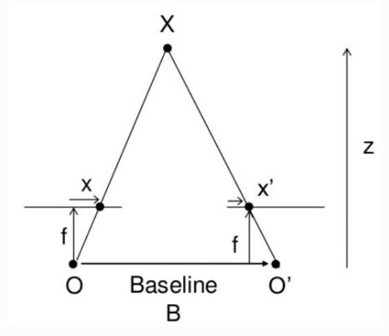
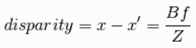

# Sawyer Picks Objects!
## Taoran Zhang
****
## Project Overview
This ROS Melodic package allows a Sawyer robot to sense the distance to an object with a specific color and pick it up.

****
## Project Structure and difficulties
This project can be devided into two main parts. One is vision part, which gives the Swayer the ability to see where the target object is. The other is the picking part, this is performed by tajectory planning. 

The main difficulty is that the built-in camera on Sawyer is a RGB camera, which doesn't have the ability to sense the distance from the camera to an object. This project tries to use the disparity between two different views to calculate the distance(depth).

## Methodology
The idea behind this multiview methodology is pretty simple, which can be better illustrated by the graph below:

Image source: OpenCV, 

Then the depth can be calculated from the formula:

Where disparity is the distance between points in image plane corresponding to the scene point 3D and their camera center. B is the distance between two cameras(which can be obtained by the movement of the Sawyer) and f is the focal length of camera(obtained by calibration). In short, above equation says that the depth of a point in a scene is inversely proportional to the difference in distance of corresponding image points and their camera centers. With this information, we can derive the depth of all pixels in an image.

## Nodes

### shoot.py
This node's job is to take pictures when the Sawyer finished moving to a specific position.       

### depthsensing.py
This is the computer vision node that reads in two images captured from different angles, extracts the center of the target object in each image, calculates the distance in pixals, and finally plugs the result into the formula and get the depth.

The depthsensing node also used the camera matrices provided from the calibration.py script in the scripts directory.  With this script, you can load about 15 images from that camera with a grided image in them and it will print the camera matrices to the screen, which were saved in the depthsensing node.  These camera matrices would have to be updated for each camera.

